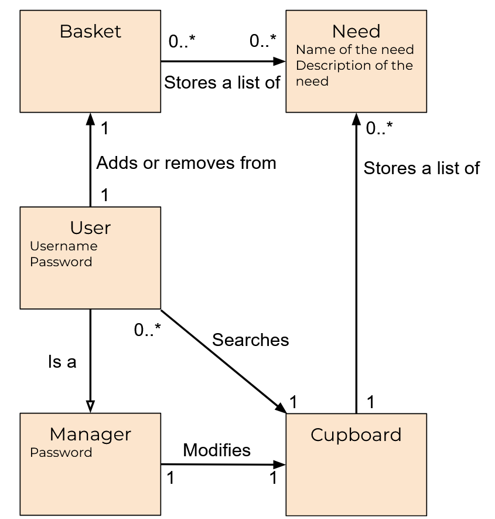
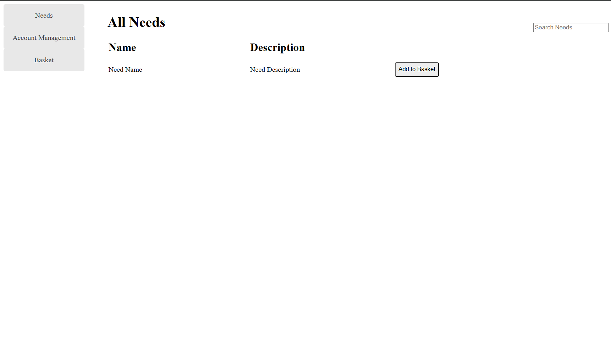
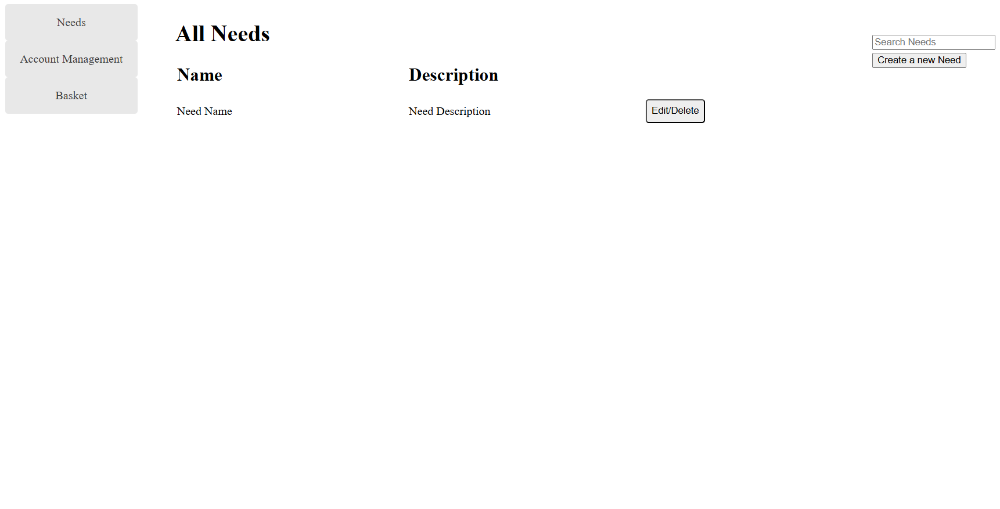
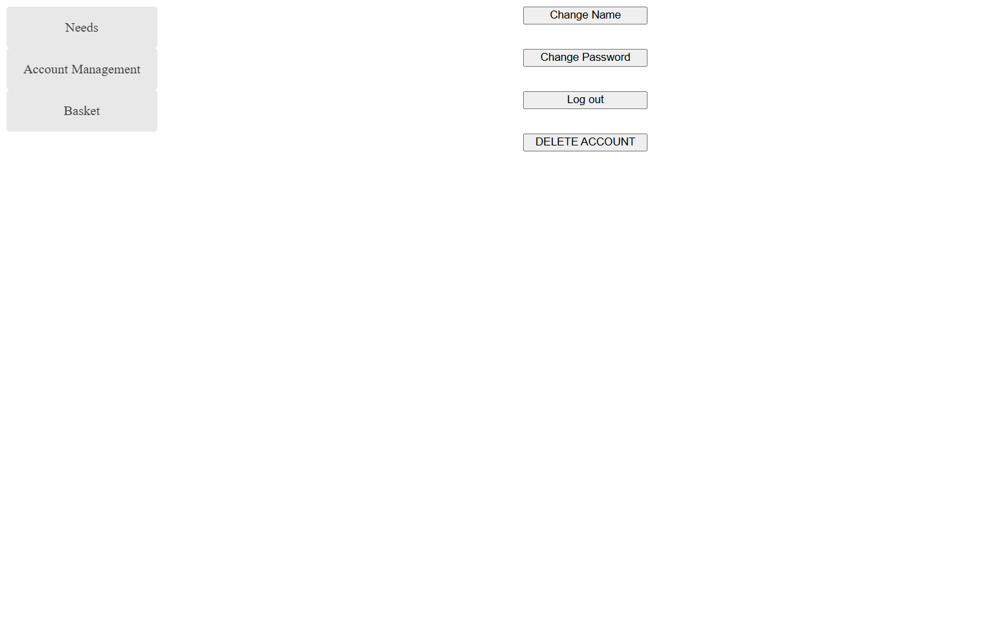

# Goated U-Fund Design Documentation

## Team Information
* Team name: Goated
* Team members
  * Anthony Ficalora
  * Ricardo Lopez
  * Matthew Beicke
  * Zach Coy

## Executive Summary

This is a summary of the project.

### Purpose
>  _**[Sprint 2 & 4]** Provide a very brief statement about the project and the most
> important user group and user goals._

### Glossary and Acronyms

| Term | Definition |
|------|------------|
| SPA | Single Page Application |
| User | Anyone who uses the system (either a helper or a manager)|

## Requirements

This section describes the features of the application.

> _In this section you do not need to be exhaustive and list every
> story.  Focus on top-level features from the Vision document and
> maybe Epics and critical Stories._

### Definition of MVP
> _**[Sprint 2 & 4]** Provide a simple description of the Minimum Viable Product._

### MVP Features
>  _**[Sprint 4]** Provide a list of top-level Epics and/or Stories of the MVP._

### Enhancements
> _**[Sprint 4]** Describe what enhancements you have implemented for the project._

## Application Domain

This section describes the application domain.

<!--DO THIS ASAP!!!!!!!!!!!!!!!!!!!!!!!!!!!!!!!!!!!!!!!!!!-->
> _**[Sprint 2 & 4]** Provide a high-level overview of the domain for this application. You
> can discuss the more important domain entities and their relationship
> to each other._

## Architecture and Design

This section describes the application architecture.

### Summary
The following Tiers/Layers model shows a high-level view of the webapp's architecture. 

The application, is built using the Model–View–Controller (MVC) architecture pattern. 
The Model stores the application data objects including any functionality to provide persistance. 
The View is the client-side SPA built with Angular utilizing HTML, CSS and TypeScript. The Controller provides RESTful APIs to the client (View) as well as any logic required to manipulate the data objects from the Model. 
Both the Controller and Model are built using Java and Spring Framework. Details of the components within these tiers are supplied below.

### Overview of User Interface

First page a user sees when visiting website is the login. Here they can enter their username and password (of which the password appears as only dots) and then press either login to login or Create Account to create an account with the inputted information.

After logging in or creating an account a user is taken to the cupboard page, seen here being viewed as a helper. Here a help can search for needs and/or add needs to their basket.

If instead the user is a manager they will see this page in which, alongside searching for needs, lets them add, edit, and delete needs.

If a helper presses on the "Basket" button on the lefthand side they can reach the basket page where they can removing things from their basket and/or checkout their basket.

If a user presses on the "Account Management" button on the lefthand side they can reach a page where they can edit their account information such as their username (only if a helper) and password as well as log out and delete their account (only if they are a helper)

### View Tier
> _**[Sprint 4]** Provide a summary of the View Tier UI of your architecture.
> Describe the types of components in the tier and describe their
> responsibilities.  This should be a narrative description, i.e. it has
> a flow or "story line" that the reader can follow._

> _**[Sprint 4]** You must  provide at least **2 sequence diagrams** as is relevant to a particular aspects 
> of the design that you are describing.  (**For example**, in a shopping experience application you might create a 
> sequence diagram of a customer searching for an item and adding to their cart.)
> As these can span multiple tiers, be sure to include an relevant HTTP requests from the client-side to the server-side 
> to help illustrate the end-to-end flow._

> _**[Sprint 4]** To adequately show your system, you will need to present the **class diagrams** where relevant in your design. Some additional tips:_
 >* _Class diagrams only apply to the **Controller** and **Model** Tier_
>* _A single class diagram of the entire system will not be effective. You may start with one, but will be need to break it down into smaller sections to account for requirements of each of the Tier static models below._
 >* _Correct labeling of relationships with proper notation for the relationship type, multiplicities, and navigation information will be important._
 >* _Include other details such as attributes and method signatures that you think are needed to support the level of detail in your discussion._

### Controller Tier

Account Controller - Provides API functionality for login, logout, api key verification, etc 
Cupboard Controller - Provides API functionality to access Need objects 
Manager Controller - Provides API functionality to for all Manager related tasks 
User Controller - Provides API functionality to for all Helper related tasks

> _**[Sprint 4]** Provide a summary of this tier of your architecture. This
> section will follow the same instructions that are given for the View
> Tier above._

> _At appropriate places as part of this narrative provide **one** or more updated and **properly labeled**
> static models (UML class diagrams) with some details such as associations (connections) between classes, and critical attributes and methods. (**Be sure** to revisit the Static **UML Review Sheet** to ensure your class diagrams are using correct format and syntax.)_
> 

### Model Tier

Manager: A manager adds and removes needs from their cupboard. 
Need: A need is some item that a manager needs funded. 
User: A user can help support a manager by funding a need. 
UserDAO: The UserDAO provides functions to store and edit users. 
CupboardDAO: The CupboardDAO provides functions to store and edit the cupboard.

In this tier, interaction with the raw data is done and manipulated. The methods in the classes here are used in the Controllers to accomplish their goals.

> _At appropriate places as part of this narrative provide **one** or more updated and **properly labeled**
> static models (UML class diagrams) with some details such as associations (connections) between classes, and critical attributes and methods. (**Be sure** to revisit the Static **UML Review Sheet** to ensure your class diagrams are using correct format and syntax.)_
> 

## OO Design Principles

Single Responsibility: We made sure that each class was small and only is responsible for themselves. 
Open/Closed: We have made it so only authorized users can access and edit data as needed. 
Information Expert: We made sure that each class has enough responsibility to access the information needed for its responsibility. 
Dependency Inversion/Injection: We use interfaces for the dependancies. 
Controller: We implemented controllers for each object. 
Pure Fabrication: We have created DAO files.

<!--DO THIS ASAP!!!!!!!!!!!!!!!!!!!!!!!!!!!!!!!!!!!!!!!!!!-->
> _**[Sprint 2, 3 & 4]** Will eventually address upto **4 key OO Principles** in your final design. Follow guidance in augmenting those completed in previous Sprints as indicated to you by instructor. Be sure to include any diagrams (or clearly refer to ones elsewhere in your Tier sections above) to support your claims._
Controller: The User, Cupboard, and Manager objects all have their own Controllers. 
Pure Fabrication: Each Object has its own DAO file for each instance of said object. 
Single Responsibility: The User, Cupboard, and Manager objects have their own Controllers. Along with that, the Needs, User, Cupboard, and Manager objects only interact with themselves, andwill not attempt to alter any other object. 
Information Expert: Each class has its own DAO file and cannot access the other DAO files. 

> _**[Sprint 3 & 4]** OO Design Principles should span across **all tiers.**_

## Static Code Analysis/Future Design Improvements
> _**[Sprint 4]** With the results from the Static Code Analysis exercise, 
> **Identify 3-4** areas within your code that have been flagged by the Static Code 
> Analysis Tool (SonarQube) and provide your analysis and recommendations.  
> Include any relevant screenshot(s) with each area._

> _**[Sprint 4]** Discuss **future** refactoring and other design improvements your team would explore if the team had additional time._

## Testing
### Acceptance Testing

<!--List how many user stories we have and for them how many acceptance criteria pass and how many fail (and give reason why)-->

By the end of Sprint 2 we have 39 User stories. 
Currently, for the acceptance criteria we have, all stories pass.

<!--What issues are/were there-->
The only issues that would arise were from faulty code. These would be fixed during the testing phase when another team member would analyze their code and figure out what went wrong, collaborate with the creator, and fix it.

### Unit Testing and Code Coverage

Our strategy for unit testing was ensure everything is covered, all possible cases.
Currently (end of Sprint 2) our code coverage is the following:

<!--List anomolies in the cc report here if there are any-->

## Ongoing Rationale

2025/10/20: Sprint 2 
Main programming for Sprint 2 is now complete, merged, and mostly tested (still need to do the actual acceptance testing writeup but).

<!--Add more stuff here following above format as it happens such as 'team decisions or design milestones/changes and corresponding justification'-->