# Goated U-Fund Design Documentation

## Team Information
* Team name: Goated
* Team members
  * Anthony Ficalora
  * Ricardo Lopez
  * Matthew Beicke
  * Zach Coy

## Executive Summary

This is a summary of the project.

### Purpose
This project aims to enable a Homeless Shelter to have their most important needs satisfied via crowdsourcing. It will allow the organizations managers to create a list of things that they do need and allow non-managers to contribute to them by adding them to a 'basket' then checking out that basket. Additionally, the project contains security measures such as encrpyted passwords, security questions (for forgot password), and API Keys. There is also the permission granted to managers to ban/unban a non manager in the event something requires it. The project also displays statistics on who has contributed the most and what proportion of needs are unfulfilled.

### Glossary and Acronyms

| Term | Definition |
|------|------------|
| SPA | Single Page Application |
| User | Anyone who uses the system (either a helper or a manager) |
| Session | An instance of a user being logged in with an API key. |
| Need | Something that a non-profit organization can get donated |
| Helper | Someone who completes needs from the Cupboard. |
| Manager | Someone who modifies the cupboard and administrates users. Cannot complete Needs. |
| Cupboard | The full list of uncompleted needs which can be completed, modified, or removed. | 

## Requirements

This section describes the features of the application.

### Definition of MVP
Helpers are able to log in to view a searchable list of as of yet unfulfilled needs. Then, they can select any number of needs to add to their basket, remove from their basket, and finally 'check out' when they are ready. Additionally, managers can log in using the username 'admin' to add, edit, and remove needs from the list.

### MVP Features
Some of the important User Stories of the MVP were:
* Login and Logout for Helpers and for Managers
* Account Creation for Helpers
* Creating/Editing/Deleting a Need
* Adding/Removing a Need to/from a Helper's Basket
* Checking out a Helper's Basket

### Enhancements
Security Package: 
All layers of the application are to be secured i.e. app will only allow you to do things _only_ if you are of a certain role. Additonally, managers can ban/unban helpers and all users can answer a security question to reset their password
* Passwords are encrypted on the server, and cannot be retrieved after being created.
* API keys are assigned to each user upon login making it impossible for the user to complete some actions without it
* Sessions will expire after one hour
* Managers can Ban and Unban users if they choose to
* All users are required to set a security question that can be answered when they forget their password

Thanks: 
App will track who fulfills what needs when and displays that to dedicated tabs alongside statistics on them.
* Default page is now the home page that displays the 5 most recently fulfilled needs as well as a button to take you to the login page
* Thanks page displays the list of all needs fulfilled
* On the thanks page there is the number of needs that were fulfilled in the past day, week, month, and year
* Also on the thanks page is a pie chart of fulfilled vs unfulfilled needs that can be sorted by Need name
* Leaderboard tab that displays the users who have contributed the most

## Application Domain

This section describes the application domain.

Entities:
* Need - Something that an organization wants to be crowdsourced
* Manager - Administrates the Cupboard, adding/editing/deleting Needs
* Helper - Any User who is not a Manager
* Basket - Unfulfilled Needs that a Helper will fulfill
* Cupboard - Container for all of the unfulfilled Needs
* Completed Need - Need that has been fulfilled already

Relationships (that werent listed above):
* Searches - A Helper can search the Cupboard to refine what Needs they can see
* Helper-Basket - Each Helper gets 1 basket
* Basket-Need - Each Basket can have any number of Needs

## Architecture and Design

This section describes the application architecture.

### Summary
The following Tiers/Layers model shows a high-level view of the webapp's architecture. 

The application, is built using the Model–View–Controller (MVC) architecture pattern. 
The Model stores the application data objects including any functionality to provide persistance. 
The View is the client-side SPA built with Angular utilizing HTML, CSS and TypeScript. The Controller provides RESTful APIs to the client (View) as well as any logic required to manipulate the data objects from the Model. 
Both the Controller and Model are built using Java and Spring Framework. Details of the components within these tiers are supplied below.

### Overview of User Interface

The first page the user sees when visiting the website is the home page. Here they can see the 5 most recently fulfilled needs as well as a button that they can press to take them to the login page.

Upon pressing the the login button the users are taken to the login page. Here they can enter their username and password (of which the password appears as only dots) and then press either login to login or Create Account to create an account with the inputted information. If the user forgets their password they can press the 'Forgot Password' button and will be prompted to enter their username and then taken to the forgot password page. Finally, the user can return to the home page by pressing 'Home'

When the user presses the forgot password button on the login page they are taken here, the forgot password page where they first must answer their security question. After getting it correct, they may update their password and are taken back to the login page.

After successfully logging in or creating an account a user is taken to the cupboard page, seen here being viewed as a helper. Here a help can search for needs and/or add needs to their basket.

If instead the user is logged in as a manager they will see this page in which, alongside searching for needs, lets them add, edit, and delete needs.

If a helper presses on the "Basket" button on the sidebar they can reach the basket page where they can removing things from their basket and/or checkout their basket.

If a user presses on the "Account Management" button on the sidebar they can reach a page where they can edit their account information such as their password and username as well as delete their account (only as a helper for the latter two)

If a user presses on the "Leaderboard" button on the sidebar they can reach the page where they can see the users who have contributed the most to this organization. They can also set the max amount of users they wish to see

If a user presses on the "Thank you" button on the sidebar they can reach the page where they can see a list of all needs fulfilled, including the user who fulfilled it and the timestamp, a pie chart that displays the proportion of needs currently fulfilled, and the number of needs fulfilled in the past day, week, month, and year.

If a manager presses on the "Users" tab on the sidebar they can see a list of all users, can search them by their username, and can ban/unban them.

### View Tier

When the user is first brought to the site they are taken to the Home Page. Here they can see a button to the login page and a list of already fulfilled needs. 
 Pressing the login button on the home page takes a user to the login page where they can login, create an account, or answer their security question to reset their password.
 If they choose to reset their password they are taken to a page where they answer their security question then can reset their password if they get it right.
 After successfully logging in or creating an account a User is taken to the Needs tab where they can see a searchable list of all unfulfilled needs. If a User is a helper they can add some to their basket. If a User is a manager they can create/edit/delete needs.
 Pressing on the Basket button on the sidebar a Helper is taken to a page where they can see their basket. Here they can remove items from it and check it out.
 Pressing the Account Management button on the sidebar a User can reset their password, delete their account, and reset their username (only if they are a helper for the latter 2).
 Pressing the Thank You! button on the sidebar lets a User see all needs that have been fulfilled as well as the number done in the last day/week/month/year.
 Pressing the Leaderboard button on the sidebar lets a User see who has checked out the most Needs.
 Pressing the Users button on the sidebar lets a manager see a searchable list of all helper accounts and lets them be able to ban or unban any user if they so choose.
 Finally, pressing the Log Out button on the sidebar logs out a User and redirects them back to the Home Page.

In addition to the above components, there are the following services that are responsible for handling the HTTP requests based on their name:
* Account Service - Does login/logout and account management related tasks
* Completed Service - Does all things for CompletedNeed objects 
* Need Service - Does all things that involve Need objects
* User Service - Does all things for the Users tab such as the banning/unbanning of Users

Below is a Sequence diagram for adding a Need to a Helper's Basket
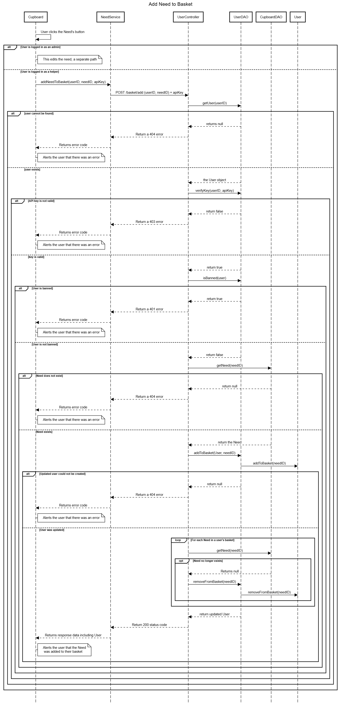

Below is a Sequence diagram for Banning/Unbanning a Helper as a Manager
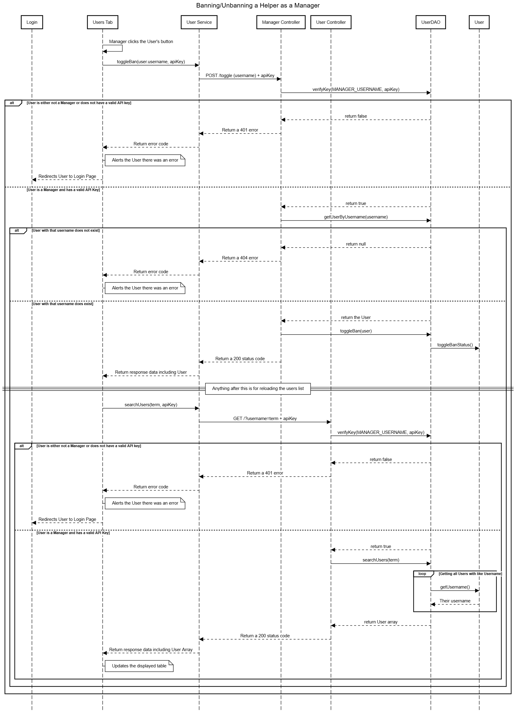

### Controller Tier

Account Controller - Provides API functionality for login, logout, api key verification, etc 
Cupboard Controller - Provides API functionality to access Need and CompletedNeed objects 
User Controller - Provides API functionality to for all Helper and mass user related tasks 
Manager Controller - Provides API functionality for all Manager realted Tasks 

When a user clicks on the buttons to add or remove a need from their basket, or to edit their account, an HTTP request is sent from the service to the UserController. From there the Controller calls the relevant DAO to get a User with the updated needs list (provided that the user is verified/logged in, a helper, not banned, and an error doesn't occur with making the updated user). It then sends a 200 status code and the updated user data back to the service which then sends it off to update what the User sees.

As with the above described controller, all other controllers also process requests from the view tier, and return the necessary data and status codes depending on the methods called using the different types of HTTP requests.

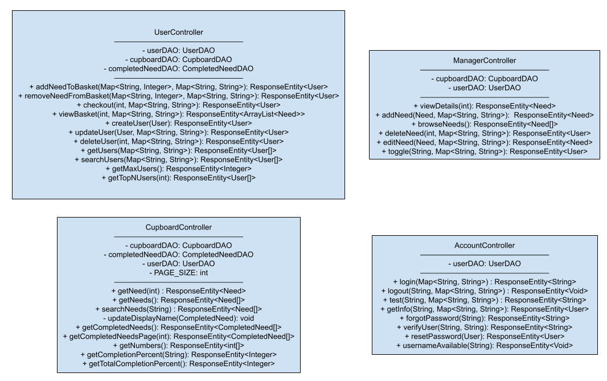

### Model Tier

Need: A need is some item that a manager needs funded. 
CompletedNeed: A Need that was fulfilled, containing the timestamp of fulfillment and user who did the fulfilling.
User: Any user, whether it be a Helper or Manager. Both can edit their accounts and have a basket, but Managers cannot modify their own. 
UserDAO: The UserDAO provides functions to store and edit users. 
CupboardDAO: The CupboardDAO provides functions to store and edit the cupboard. 
CompletedNeedDAO: Provides functions to store and edit the completedneed catalog.

In this tier, interaction with the raw data is done and manipulated. The methods in the classes here are used in the Controllers to accomplish their goals.

## OO Design Principles

Design Principles in our code: 
- Single Responsibility: The User, Need, and CompletedNeed objects have their own Controllers. Along with that, the Need and User objects only interact with themselves, and will not attempt to alter any other object. Each of the controllers only do what they alone need to do, such as UserController _only_ determining which DAOs will be activated, and UserDAO _only_ modifing the User objects that need to be edited, and not modifying any other objects (i.e. completing a Need, which is CupboardDAO's responsibility) 
- Open/Closed: We created DAO (e.g. CupboardDAO) interfaces and FileDAO (e.g. CupboardFileDAO) classes. Of these, CupboardDAO is closed for modification since exactly all of its functionality must be implemented, while CupboardFileDAO is open to include more features such as internal functions needed to save data to disk. This can be clearly seen in the Model Tier diagram, where UserFileDAO has many more functions than UserDAO had.
- Dependency Injection: The various Controllers take as input the interface DAO, instead of the FileDAO implementation. On the web side, each of the components take in Services in their constructors meaning they can be easily swapped out for another implementation. 
- Controller: The User, Need, and CompletedNeed objects all have their own Controllers, which lie as one of the intermediate steps between the user and the backend storage. This can be seen in the Tiers/Layers model where each of the controllers lie between front and backend. 
- Information Expert: Each class has its own DAO file and cannot access the other DAO files. Additionally, each piece of necessary information is retrieved from its storage medium instead of being taken from another controller or being haphazardly stored by itself. 
- Low Coupling: Low coupling was difficult to achieve as many functions demanded access to multiple files at once, such as generating the strings for completed needs, requiring a completed need object and a user object, which would otherwise be unnecessary in the CupboardController. However, classes in the same layer were decoupled to not depend on each other - a Controller only ever called a DAO, which then only ever modified some Model. 

## Static Code Analysis/Future Design Improvements

During our first iteration of static code analysis, we had 270 issues for our Java code. This was whittled down to 12 by the end of Sprint 3.
Some of the our critical fixes were:
1)  170 of the issues were tagged as "info", since each test case erroneously included the "public" keywords. These were removed to comply with testing standards. 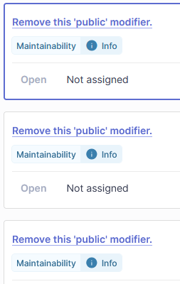
2)  Many issues arose as a result of poor standardization. Across almost all of the classes, low and medium severity issues came up about poor formatting, consistency, and repetition. 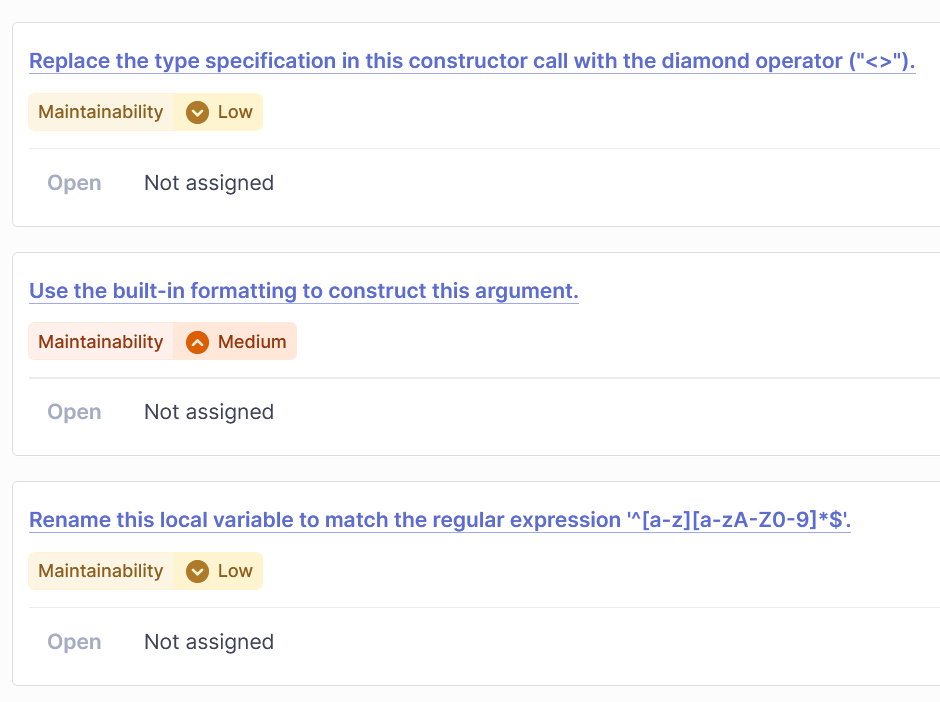
3)  A major issue with our key generation was how our randomizer was both inefficient and insecure. The Random object was no longer duplicated then replaced with SecureRandom to ensure that our security system was effective. 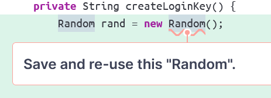 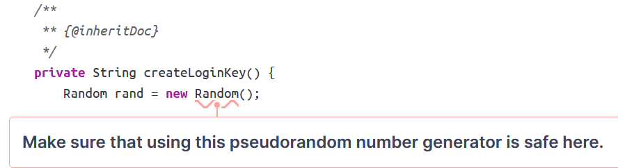

Additionally, the duplication section of SonarQube indicated that some of our code was duplicated. 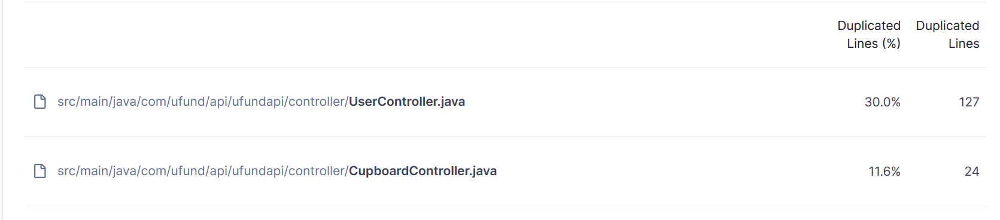 As a result, we decided to remove one of the duplicates as it was no longer being referenced anywhere else in the codebase.

One design improvement our team would explore given additional time is refactoring the CompletedNeeds system. It currently is included within the CupboardController, but the CupboardController class depends on many unrelated pieces of data which could be separated if care is taken. Another consideration could be dividing the different tasks a User can do into separate controllers, since the plentiful actions they can perform are included in one cluttered file. Many of these methods do not need involvement with every DAO at once, meaning there can be less coupling between layers.

For the interface side of things, we ended with 75 open issues. 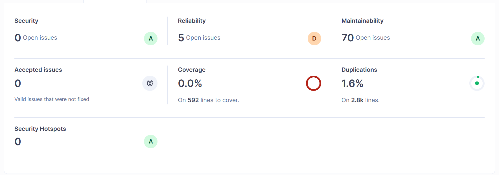 A majority of these were because we did not use standalone, often did not implement OnInit, and did not use 'readonly' for any of our service injections.
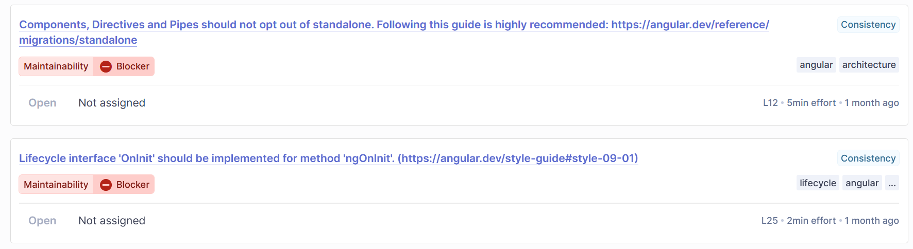
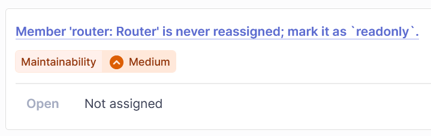

## Testing
### Acceptance Testing

By the end of Sprint 3 we have 60 User stories. 
We had an issue in Sprint 2 where some tests failed, but it was because we had decided to not implement the features listed in the acceptance criteria but failed to change them after we decided that. That feature being there was no home page. Besides that however, all acceptance tests do pass however we could have benefitted from having more especially for the fail cases at least for the tests for Sprint 3.

### Unit Testing and Code Coverage

Our strategy for unit testing was ensure everything is covered, all possible cases.
Since we were unsure what the "ufundapi" tests were for (as there was like 3 lines of code in that java class) we chose to ignore the premade test case. In retrospect we should have asked how to test for that.

Currently (end of Sprint 3) our code coverage is the following:

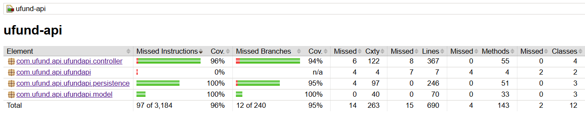

## Ongoing Rationale

2025/10/19: Sprint 2 
Main programming for Sprint 2 is now complete, merged, and mostly tested (still need to do the actual acceptance testing writeup but).

2025/10/21: Sprint 2 
All programming tasks, testing, documentation, demo planning has been completed at this time.

2025/11/9: Sprint 3 
All programming for this sprint has been completed at this time, just documentation, demo, and acceptance testing left

2025/11/12: Sprint 3 
After these docs are pushed all code for the project should be completed (Sprint 3 is done).

2025/11/23: Sprint 4 
Docs for Sprint 4 should be nearly done