# Goated U-Fund Design Documentation

## Team Information
* Team name: Goated
* Team members
  * Anthony Ficalora
  * Ricardo Lopez
  * Matthew Beicke
  * Zach Coy

## Executive Summary

This is a summary of the project.

### Purpose
<!---
>  _**[Sprint 2 & 4]** Provide a very brief statement about the project and the most
> important user group and user goals._
--->
This project aims to enable organizations to have their most important needs satisfied via crowdsourcing. It will allow organization managers to create a list of things that they do need and allow non-managers to contribute to them by adding them to a 'basket' then checking out that basket. Additionally, the project contains security measures such as encrpyted passwords, security questions (for forgot password), and API Keys. There is also the permission granted to managers to ban/unban a non manager in the event something requires it. The project also displays statistics on who has contributed the most and what proportion of needs are unfulfilled.
### Glossary and Acronyms

| Term | Definition |
|------|------------|
| SPA | Single Page Application |
| User | Anyone who uses the system (either a helper or a manager) |
| Session | An instance of a user being logged in with an API key. |

## Requirements

This section describes the features of the application.

### Definition of MVP
Non-profit groups require many donations to be sustainable, and the problem of requesting and satisfying these needs poses a issue. The large, sweeping demands can dissuade potential donors from helping the organization. What if instead, all of the needs an organization could have were broken down into smaller, more accessible requests? Our project aims to enable prospective supporters to contribute to a greater cause. Users are able to log in to view the list of available needs. Then, they can select any number of needs to add to their basket, and check out when they are ready. Additionally, managers can log in to add, edit, and remove needs.

### MVP Features
>  _**[Sprint 4]** Provide a list of top-level Epics and/or Stories of the MVP._

### Enhancements
Security Package:
* Passwords are encrypted on the server, and cannot be retrieved after being created.
* API keys are assigned to each user upon login making it impossible for the user to complete some actions without it
* Sessions will expire after one hour
* Managers can Ban and Unban users if they choose to
* All users are required to set a security question that can be answered when they forget their password

Thanks:
* Default page is now the home page that displays the 5 most recently fulfilled needs as well as a button to take you to the login page
* Thanks page displays the list of all needs fulfilled
* On the thanks page there is the number of needs that were fulfilled in the past day, week, month, and year
* Also on the thanks page is a pie chart of fulfilled vs unfulfilled needs that can be sorted by Need name
* Leaderboard tab that displays the users who have contributed the most

## Application Domain

This section describes the application domain.

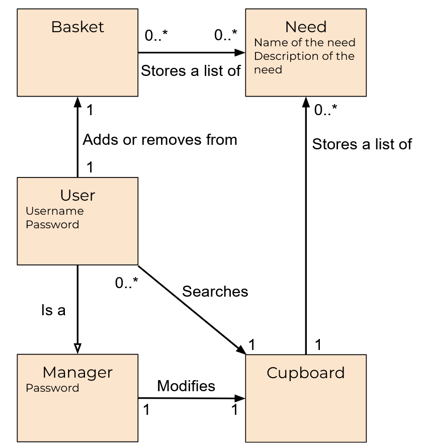

The donation service has managers that can add needs to a public list called a cupboard. Helpers can then choose from the needs added by managers, and add/remove the need to/from a basket that the helper can manage. The helper can then checkout the needs once they've been fufilled, removing them from both the helper's basket, and the cupboard.

## Architecture and Design

This section describes the application architecture.

### Summary
The following Tiers/Layers model shows a high-level view of the webapp's architecture. 
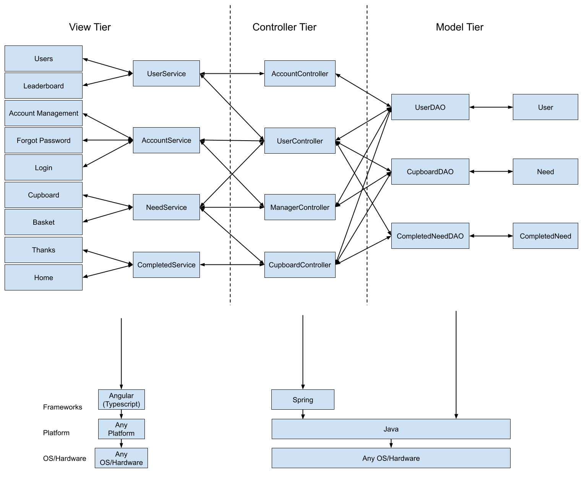

The application, is built using the Model–View–Controller (MVC) architecture pattern. 
The Model stores the application data objects including any functionality to provide persistance. 
The View is the client-side SPA built with Angular utilizing HTML, CSS and TypeScript. The Controller provides RESTful APIs to the client (View) as well as any logic required to manipulate the data objects from the Model. 
Both the Controller and Model are built using Java and Spring Framework. Details of the components within these tiers are supplied below.

### Overview of User Interface

The first page the user sees when visiting the website is the home page. Here they can see the 5 most recently fulfilled needs as well as a button that they can press to take them to the login page.
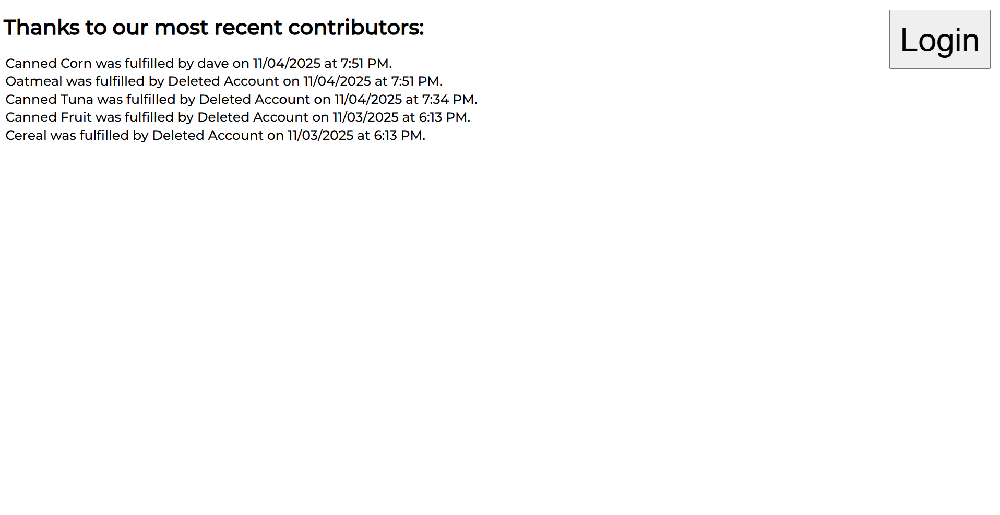

Upon pressing the the login button the users are taken to the login page. Here they can enter their username and password (of which the password appears as only dots) and then press either login to login or Create Account to create an account with the inputted information. If the user forgets their password they can press the 'Forgot Password' button and will be prompted to enter their username and then taken to the forgot password page. Finally, the user can return to the home page by pressing 'Home'

When the user presses the forgot password button on the login page they are taken here, the forgot password page where they first must answer their security question. After getting it correct, they may update their password and are taken back to the login page.
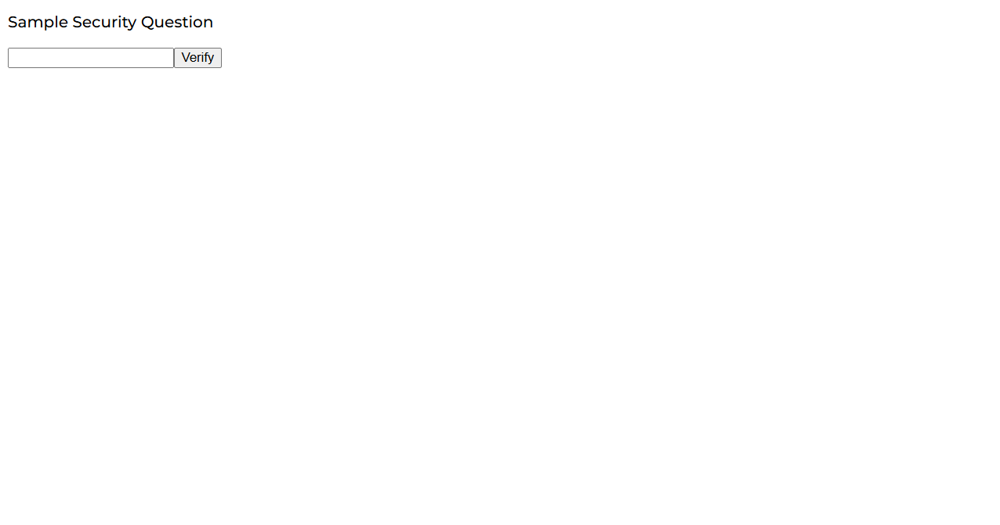

After successfully logging in or creating an account a user is taken to the cupboard page, seen here being viewed as a helper. Here a help can search for needs and/or add needs to their basket.
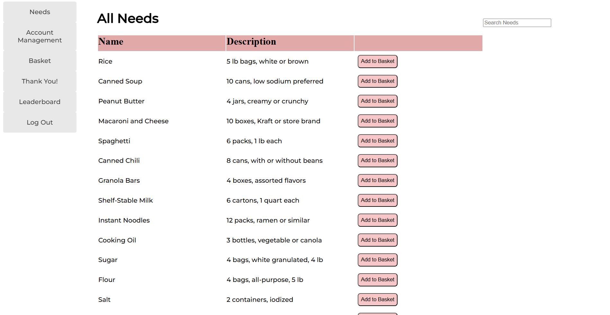

If instead the user is logged in as a manager they will see this page in which, alongside searching for needs, lets them add, edit, and delete needs.
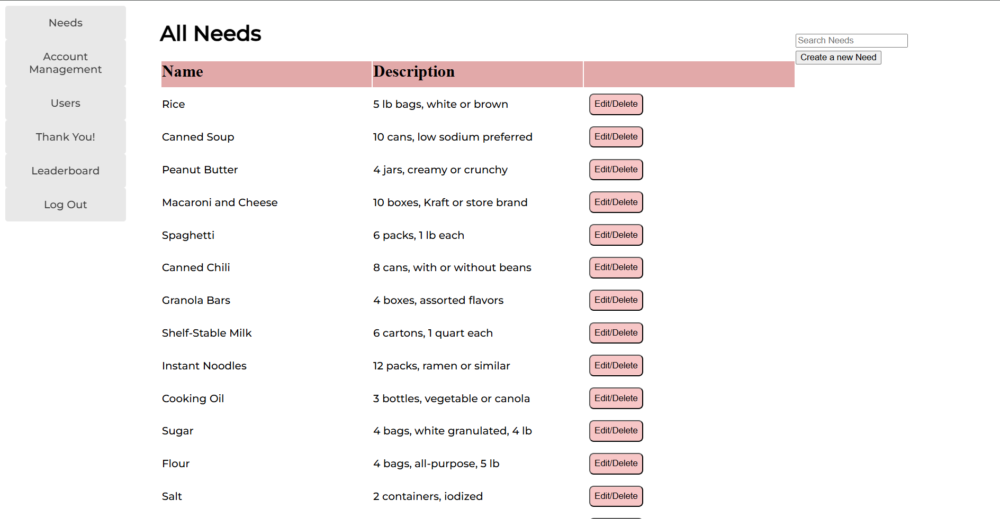

If a helper presses on the "Basket" button on the sidebar they can reach the basket page where they can removing things from their basket and/or checkout their basket.
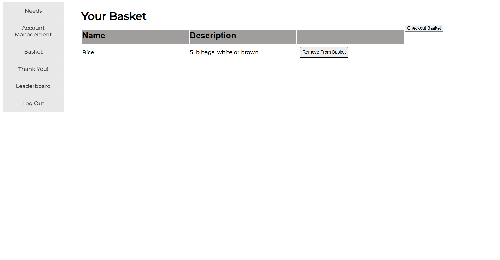

If a user presses on the "Account Management" button on the sidebar they can reach a page where they can edit their account information such as their password and username as well as delete their account (only as a helper for the latter two)
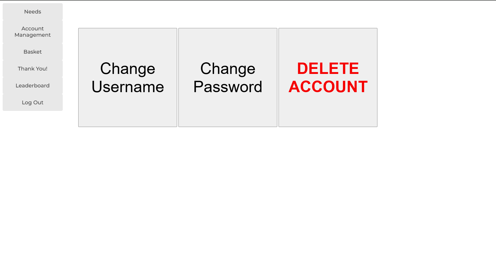

If a user presses on the "Leaderboard" button on the sidebar they can reach the page where they can see the users who have contributed the most to this organization. They can also set the max amount of users they wish to see
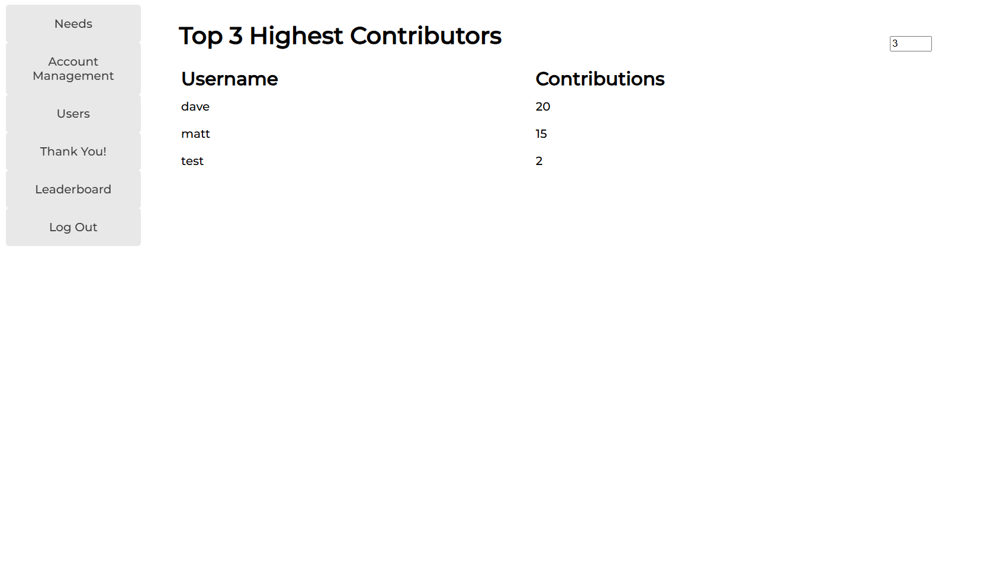

If a user presses on the "Thank you" button on the sidebar they can reach the page where they can see a list of all needs fulfilled, including the user who fulfilled it and the timestamp, a pie chart that displays the proportion of needs currently fulfilled, and the number of needs fulfilled in the past day, week, month, and year.
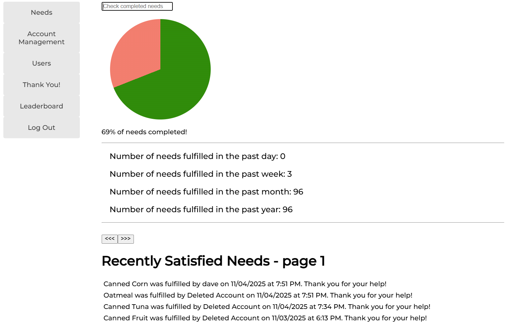

If a manager presses on the "Users" tab on the sidebar they can see a list of all users, can search them by their username, and can ban/unban them.
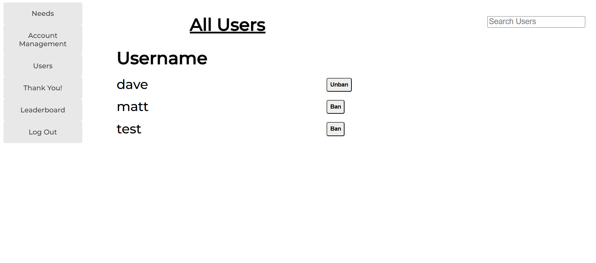

### View Tier
> _**[Sprint 4]** Provide a summary of the View Tier UI of your architecture.
> Describe the types of components in the tier and describe their
> responsibilities.  This should be a narrative description, i.e. it has
> a flow or "story line" that the reader can follow._

> _**[Sprint 4]** You must  provide at least **2 sequence diagrams** as is relevant to a particular aspects 
> of the design that you are describing.  (**For example**, in a shopping experience application you might create a 
> sequence diagram of a customer searching for an item and adding to their cart.)
> As these can span multiple tiers, be sure to include an relevant HTTP requests from the client-side to the server-side 
> to help illustrate the end-to-end flow._

> _**[Sprint 4]** To adequately show your system, you will need to present the **class diagrams** where relevant in your design. Some additional tips:_
 >* _Class diagrams only apply to the **Controller** and **Model** Tier_
>* _A single class diagram of the entire system will not be effective. You may start with one, but will be need to break it down into smaller sections to account for requirements of each of the Tier static models below._
 >* _Correct labeling of relationships with proper notation for the relationship type, multiplicities, and navigation information will be important._
 >* _Include other details such as attributes and method signatures that you think are needed to support the level of detail in your discussion._

### Controller Tier

Account Controller - Provides API functionality for login, logout, api key verification, etc 
Cupboard Controller - Provides API functionality to access Need and CompletedNeed objects 
Manager Controller - Provides API functionality to for all Manager related tasks 
User Controller - Provides API functionality to for all Helper and mass user related tasks

> _**[Sprint 4]** Provide a summary of this tier of your architecture. This
> section will follow the same instructions that are given for the View
> Tier above._

> _At appropriate places as part of this narrative provide **one** or more updated and **properly labeled**
> static models (UML class diagrams) with some details such as associations (connections) between classes, and critical attributes and methods. (**Be sure** to revisit the Static **UML Review Sheet** to ensure your class diagrams are using correct format and syntax.)_
> 
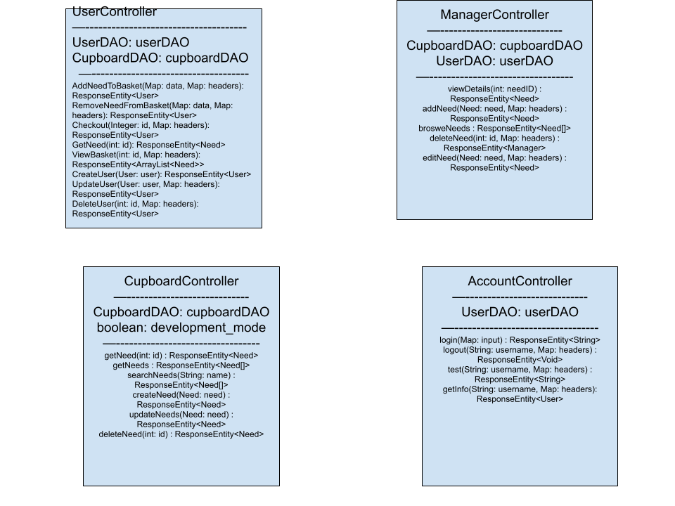

### Model Tier

Manager: A manager adds and removes needs from the cupboard. 
Need: A need is some item that a manager needs funded. 
CompletedNeed: A Need that was fulfilled, containing the timestamp of fulfillment and user who did the fulfilling.
User: A user can help support a manager by funding a need. 
UserDAO: The UserDAO provides functions to store and edit users. 
CupboardDAO: The CupboardDAO provides functions to store and edit the cupboard. 
CompletedNeedDAO: Provides functions to store and edit the completedneed catalog.

In this tier, interaction with the raw data is done and manipulated. The methods in the classes here are used in the Controllers to accomplish their goals.

> _At appropriate places as part of this narrative provide **one** or more updated and **properly labeled**
> static models (UML class diagrams) with some details such as associations (connections) between classes, and critical attributes and methods. (**Be sure** to revisit the Static **UML Review Sheet** to ensure your class diagrams are using correct format and syntax.)_
> 

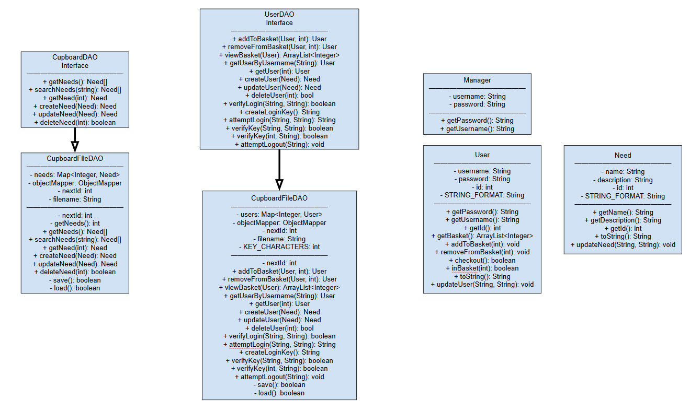

## OO Design Principles

Single Responsibility: We made sure that each class was small and only is responsible for themselves. 
Open/Closed: We have made it so only authorized users can access and edit data as needed. 
Information Expert: We made sure that each class has enough responsibility to access the information needed for its responsibility. 
Dependency Inversion/Injection: We use interfaces for the dependancies. 
Controller: We implemented controllers for each object. 
Pure Fabrication: We have created DAO files.

Key OO Design Principles: 
Controller: The User, Cupboard, and Manager objects all have their own Controllers. 
Pure Fabrication: Each Object has its own DAO file for each instance of said object. 
Single Responsibility: The User, Cupboard, and Manager objects have their own Controllers. Along with that, the Needs, User, Cupboard, and Manager objects only interact with themselves, and will not attempt to alter any other object. 
Information Expert: Each class has its own DAO file and cannot access the other DAO files. 

> _**[Sprint 3 & 4]** OO Design Principles should span across **all tiers.**_

## Static Code Analysis/Future Design Improvements
> _**[Sprint 4]** With the results from the Static Code Analysis exercise, 
> **Identify 3-4** areas within your code that have been flagged by the Static Code 
> Analysis Tool (SonarQube) and provide your analysis and recommendations.  
> Include any relevant screenshot(s) with each area._

> _**[Sprint 4]** Discuss **future** refactoring and other design improvements your team would explore if the team had additional time._

## Testing
### Acceptance Testing

<!--List how many user stories we have and for them how many acceptance criteria pass and how many fail (and give reason why)-->

By the end of Sprint 2 we have 39 User stories. 
Currently, for the acceptance criteria we have, all stories pass.

<!--What issues are/were there-->
The only issues that would arise were from faulty code. These would be fixed during the testing phase when another team member would analyze their code and figure out what went wrong, collaborate with the creator, and fix it.

### Unit Testing and Code Coverage

Our strategy for unit testing was ensure everything is covered, all possible cases.
Currently (end of Sprint 2) our code coverage is the following:

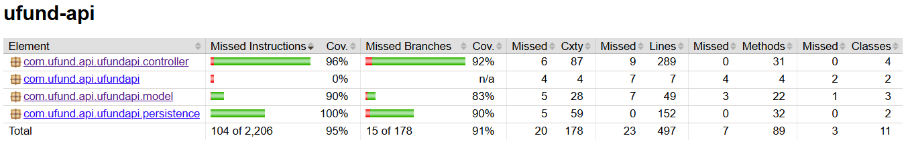

<!--List anomolies in the cc report here if there are any-->

## Ongoing Rationale

2025/10/19: Sprint 2 
Main programming for Sprint 2 is now complete, merged, and mostly tested (still need to do the actual acceptance testing writeup but).

2025/10/21: Sprint2 
All programming tasks, testing, documentation, demo planning has been completed at this time.

<!--Add more stuff here following above format as it happens such as 'team decisions or design milestones/changes and corresponding justification'-->